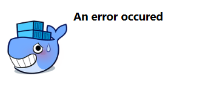

This is a short summary of my, somewhat painful, route to discovery that what I thought I knew about Docker was in fact just the tip of the iceberg. Fortunately to me, working in Stencila I upgraded my knowledge through testing and using [Dockter](https://stencila.github.io/dockter/),  a container image builder for researchers.

I used Docker for the first time several years ago when it entered the world of computational research. Working with computational research communities I was well aware of the problems with reproducibility due to dependency hell. Docker images appeared to be (and are!) a great solution. However, not actually doing
computational research myself, I only used Docker a couple of times following a tutorial to build an image just to see how it would go. It went all fine, as usually well prepared tutorials present the user with a typical and uncomplicated case. I have run several Docker images that I got from the depot. That has also worked fine for me. And that would be it when it came to my hands-on experience with Docker. 

{style="width: 80%;" }

Hence I was convinced that Docker is the silver bullet for the reproducibility problems in computational research. I happily recommended Docker to a number of researchers that I talked to and even to some developers who were struggling with dependency hell. It was only after I started helping with Stencila's Dockter that I understood how naive I was.

First thing first, I didn't realize that rebuilding images with Docker can take a long time even if you only changed a tiny bit in your Dockerfile. In most cases, it is a recommended practice to create Docker images with as few layers as possible. That means that making even small changes in listing required packages in Dockerfile results in Docker rebuilding the whole image. Dockter deals with that problem pretty well by rebuilding the images from the layer where changes occurred. 

Really excited about that feature (which Nokome Bentley had to explain to me a few times so that I actually got it), I started trying out Dockter with a few examples that I was hoping to publish as a part of Stencila Dockter tutorial. Everything would be fine except that one morning my Linux just refused to boot in. After frustrating few hours of trying to fix the problem using `fdisk` (suspecting segmentation fault), I booted into Windows on my dual-boot machine to do actual work. The following day using Ubuntu Live USB I got into the Linux partition and discovered that it was pretty much full. My experiments with fast rebuilding Docker images with Dockter resulted in a massive pile of Docker images that stuffed up the disk. 

That's the second lesson I learnt about Docker. Clean up your images regularly. They can take a lot of space. Whilst obvious, I suppose it wasn't much of an issue when I was trying out Docker writing Dockerfiles manually. Rebuilding images involved more effort and it made me think about deleting the old image before I built the new one. With Dockter all I had to do to rebuild images was to change the example code in R or Python and re-run `docker build`.

Conscious of the problem I nuked all Docker images which I created with Dockter and successfully logged back into Linux. Still working on the Dockter tutorial, I wanted to be smarter and sometimes would just halt the building process through the ever convenient "Ctrl+C". Due to the previous image disaster, I was monitoring how much the free space on my drive was shrinking and rather nervously listing the images on the disk. That's how I discovered *Docker dangling images*. I'm not sure if it was me hitting "Ctrl+C" too much that caused but now I know how to [purge all Docker images effectively](https://docs.docker.com/engine/reference/commandline/system_prune/). It will bite me back one day but so far so good.

Would I still recommend Docker for reproducible research? Yes. I would recommend learning it using Dockter. Despite what I described above, it does make your life easier.

